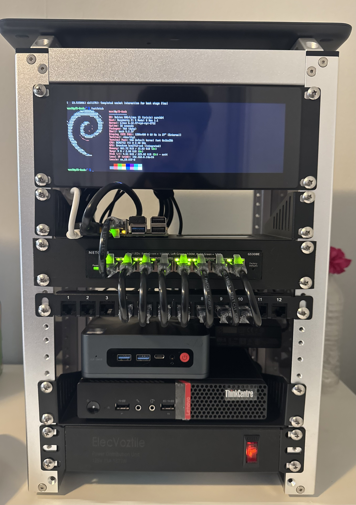

# homelab

Welcome to my personal homelab: A Raspberry Pi 5–driven control and monitoring hub connected to two Proxmox mini-PC nodes, managed through a (WIP) touchscreen dashboard.

---





---

## ⚙️ Components

| Device | Purpose | OS | IP |
|--------|----------|----|---|
| Raspberry Pi 5 (16 GB) | Dashboard + Docker host | Pi OS Lite | 192.168.8.10 |
| Proxmox-1 (ThinkCentre) | Main node | Proxmox VE 8 | 192.168.8.11 |
| Proxmox-2 (Beelink) | Secondary node | Proxmox VE 8 | 192.168.8.12 |
| Netgear GS308E | Switch | — | 192.168.8.2 |
| GL-iNet Beryl AX | Router | OpenWRT | 192.168.8.1 |

---

## 🧩 Services on Raspberry Pi

| Service | Purpose | URL |
|----------|----------|-----|
| Portainer | Docker management | `:9000` |
| Node-RED | Touchscreen dashboard | `:1880` |
| Grafana | Metrics visualization | `:3000` |
| Prometheus | System metrics collection | `:9090` |
| Vaultwarden | Password manager | `:8080` |
| Uptime Kuma | Service monitoring | `:3001` |
| AdGuard Home | Network-wide DNS filtering | `:53` |

---

## 📈 Monitoring Stack

- **Prometheus** scrapes Proxmox, Pi, and container metrics.
- **Grafana** visualizes system load, uptime, and resource usage.
- **Uptime Kuma** monitors services with alert rules.
- **Node-RED** touchscreen UI integrates all dashboards.

---

## 🪜 Quick Start

```bash
git clone https://github.com/manirajchahal/homelab-infrastructure.git
cd homelab/configs/raspberrypi
docker compose up -d
```

---

## 🔧 Notes

- Every major component (Pi, Proxmox, Switch, Firewall) gets its **own config folder**.
- `docs/` = readable documentation.
- `configs/` = actual `.yml`, `.cfg`, or `.json` files.
- `scripts/` =  automation logic (setup, backups, updates).
- `dashboards/` = Grafana & Node-RED exports.
- `assets/` = diagrams & photos.
- `backups/` = snapshot plans, schedules, and notes.
